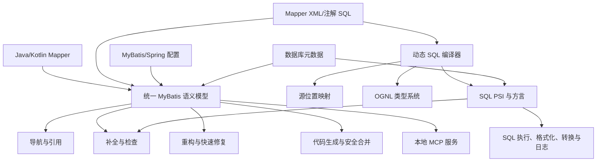

# MyBatis IDEA Assistant 交付阶段实施规划

> 文档版本：0.2
> 编写日期：2026-08-09
> 更新日期：2026-08-12
> 当前状态：执行中；B01～B04、S0～S3 已验收，S4～S12 为代码/阶段证据收口，S13 为正式交付阻断门收口
> 初始目标平台：IntelliJ IDEA 2026.1 统一发行版（Build 261）
> 最终目标：达到可长期维护、可公开发布的正式交付质量

## 1. 文档目的

本文用于指导 `mybatis-idea-assistant` 从零实现为完整、可交付的 IntelliJ IDEA 插件。它不是单纯的功能愿望清单，而是后续开发、测试、验收和发布的共同基线。

所有阶段都必须满足以下规则：

1. 每个阶段必须有可运行产物、自动化测试和明确退出条件。
2. 未通过当前阶段阻断门，不得用后续功能掩盖基础缺陷。
3. AI 生成代码不等于完成；只有构建、测试、IDE 实测和回归均通过才算完成。
4. 所有修改项目文件的操作必须可撤销；生成器不得静默覆盖用户手写代码。
5. 以公开文档、公开标准、开源许可证允许使用的代码和自行设计的行为规范为依据，独立实现，不反编译、不复制商业插件代码、资源、名称或界面。

## 2. 产品目标与边界

### 2.1 产品目标

最终产品应覆盖 MyBatis 日常开发的完整链路：

- 识别项目中的 MyBatis、MyBatis-Plus、MyBatis-Flex 和常见扩展框架。
- 建立 Java/Kotlin Mapper、XML、注解 SQL、实体类、数据库表之间的语义关系。
- 提供跳转、查找引用、重命名、补全、检查、快速修复和安全生成能力。
- 正确理解 MyBatis 动态标签、参数表达式和常用 OGNL。
- 连接真实数据库元数据，提供类型安全的 SQL 辅助。
- 支持数据库到代码、代码到 DDL、SQL 到 Mapper/模型的双向生成。
- 支持日志还原 SQL、快速测试 SQL、测试用例生成和 SQL 格式化。
- 在大型、多模块、混合 Java/Kotlin 项目中保持稳定和可接受的性能。
- 具备正式发布所需的兼容验证、签名、文档、隐私、安全和回滚能力。

### 2.2 “达到交付条件”的定义

达到交付条件不以“菜单已经出现”判断，而以以下结果共同判断：

- 承诺的功能全部有行为规范和测试覆盖。
- 已知 P0、P1 缺陷为零。
- 最近支持范围内的 IDE 版本全部通过 Plugin Verifier 和真实 IDE 冒烟测试。
- 核心功能在大型样例项目中无明显卡顿、死锁、索引风暴或内存泄漏。
- 所有写文件能力支持预览、撤销、冲突检测和失败恢复。
- 可选依赖被禁用或不存在时，插件仍能正常加载，相关功能自然降级。
- 无默认遥测、无默认联网、无明文保存数据库密码、无敏感日志泄露。
- 用户文档、变更日志、兼容矩阵、故障排查和回滚说明齐全。

### 2.3 当前不包含的内容

以下内容不是首轮开发目标，只有用户后续明确授权才进入范围：

- 付费授权、激活服务器、设备绑定和反破解系统。
- 默认上传项目代码、数据库结构、SQL 或使用统计。
- 云端账号、多人协作和 SaaS 后台。
- 对其他商业插件的二进制分析、反编译或行为绕过。

## 3. 目标环境与兼容策略

采用“先收窄、再扩展”的兼容策略，避免在语义核心尚未稳定时同时承担跨版本成本。

| 维度 | 第一阶段目标 | 完整交付目标 |
|---|---|---|
| IDE | IntelliJ IDEA 2026.1 统一发行版 / 261 | 最近四个稳定大版本，按兼容适配层维护 |
| 运行系统 | macOS ARM64 | macOS、Windows、Linux |
| 插件开发语言 | Java 21 为主，必要时使用 Kotlin | Java/Kotlin 混合，公共核心保持 Java 友好 |
| 构建系统 | Gradle 9、IntelliJ Platform Gradle Plugin 2.x | 同左，并接入版本目录和依赖锁定 |
| 项目语言 | Java | Java、Kotlin K2 |
| MyBatis | MyBatis 3、Spring Boot 常用配置 | MyBatis、MyBatis-Plus、MyBatis-Flex、TkMapper 等 |
| 数据库 | IDEA Database Tools 中的 MySQL | MySQL、PostgreSQL、Oracle、SQL Server、SQLite、达梦等 |
| IDE 版本 | IntelliJ IDEA 统一发行版 | IntelliJ IDEA 各授权层级、Android Studio |
| 数据源 | IDEA 内置数据源 | 内置数据源 + 社区版自建 JDBC 数据源 |

兼容代码必须通过适配层访问容易变化的 IDE API。业务核心不得直接散落对某一 IDE 版本内部类的依赖。

## 4. 完整功能基线

| 领域 | 交付目标能力 | 优先级 |
|---|---|---:|
| 项目识别 | 自动识别 Mapper、XML、配置、扫描包、TypeAlias、框架类型 | P0 |
| 导航 | Mapper/XML 双向跳转、多 XML、继承方法、Provider、行标图标 | P0 |
| 引用 | `namespace`、statement id、`refid`、`resultMap`、property、column 引用解析 | P0 |
| 检查 | 缺失/重复 statement、错误属性、错误参数、未使用 SQL、错误列、危险 SQL | P0 |
| 快速修复 | 创建 XML/statement、添加 `@Param`、补齐 resultMap、修复引用 | P0 |
| 参数语义 | 单参数、多参数、`@Param`、集合、数组、Map、泛型、嵌套属性、特殊别名 | P0 |
| ResultMap | property/column 补全、校验、构造器、association、collection、columnPrefix | P0 |
| 动态 SQL | `if`、`choose`、`when`、`where`、`set`、`trim`、`foreach`、`include`、`bind` | P0 |
| OGNL | 补全、类型推导、方法调用、索引访问、静态成员、重命名、错误检查 | P0 |
| SQL 能力 | 动态 SQL 展平、语法注入、表列补全、类型检查、方言处理、错误回映射 | P0 |
| 数据库生成 | 表生成 Entity、Mapper、XML、Service；模板、自定义类型、批量生成 | P0 |
| 安全合并 | 重复生成仅更新生成区，保留手写方法、注解、字段和 XML | P0 |
| 方法名生成 | 确定性查询、更新、删除、统计、排序、分页、set-based 批量与动态条件 | P1 |
| Wrapper 生成 | MyBatis-Plus/MyBatis-Flex QueryWrapper 等 | P1 |
| 双向转换 | SQL 生成 XML/接口/ResultMap/Java 类；Java 类生成 DDL | P1 |
| SQL 工具 | 日志转 SQL、格式化、运行 SQL、参数面板、测试用例生成 | P1 |
| Spring 支持 | MapperScan、Mapper 注入、Spring Boot 配置和别名解析 | P1 |
| 注解支持 | `@Select` 等注解补全、检查、跳转、迁移到 XML | P1 |
| Kotlin 支持 | Kotlin Mapper、属性、泛型、K2 模式和可选依赖隔离 | P1 |
| 多框架/多数据库 | 框架适配器、数据库方言、关键字和类型映射 | P1 |
| MCP | 只读查询 Mapper、statement、表列；受控生成和测试工具 | P2 |
| 产品化 | 设置、导入导出、国际化、签名、更新、隐私和 Marketplace 交付 | P0 |

## 5. 总体架构

### 5.1 逻辑模块

| 模块 | 职责 |
|---|---|
| `platform-core` | IDE 生命周期、项目服务、线程模型、设置、通知、兼容适配 |
| `mybatis-model` | XML DOM、Mapper/实体解析、参数模型、TypeAlias、框架识别 |
| `mybatis-index` | namespace、statement、resultMap、sql fragment、别名等增量索引 |
| `navigation` | 行标、声明跳转、查找引用、实现关系、多目标导航 |
| `completion` | XML 属性、参数表达式、SQL、OGNL、方法名等补全 |
| `inspection` | Java/XML/SQL/OGNL 检查、问题分级和 Quick Fix |
| `refactor` | 跨 Java/XML/OGNL 的安全重命名和引用更新 |
| `dynamic-sql` | 动态标签展开、分支建模、占位符、include/foreach 处理 |
| `source-map` | 虚拟 SQL、OGNL 与原始 XML 文本范围的双向映射 |
| `ognl-language` | 词法、语法、PSI、类型推导、引用、补全和检查 |
| `sql-bridge` | SQL 语言注入、方言、Database Tools 接入和类型安全分析 |
| `database` | Ultimate 数据源与社区版 JDBC 数据源的统一抽象 |
| `generator` | 模板、命名、类型映射、预览、冲突检测和安全合并 |
| `converters` | SQL/XML/Java/DDL/ResultMap 之间的转换 |
| `sql-tools` | 日志还原、格式化、运行、参数面板和测试用例生成 |
| `framework-adapters` | MyBatis-Plus、Flex、TkMapper、Spring、Kotlin 等适配器 |
| `mcp-server` | 本地、可关闭、最小权限的 MCP 工具服务 |

这些模块初期可以位于一个 Gradle 插件工程中，但包边界、依赖方向和测试夹具必须从第一天保持独立。可选 IDE 插件依赖必须使用独立描述文件加载，避免用户禁用 Kotlin、Spring、YAML 或 Database Tools 后整个插件无法启动。

### 5.2 核心设计原则

1. **语义模型唯一**：导航、补全、检查、重构和生成共享同一套参数、实体、statement 和数据库模型。
2. **增量优先**：依赖 Stub/FileBasedIndex、CachedValue 和修改追踪器，不在编辑或补全时全项目扫描。
3. **PSI 生命周期安全**：跨异步任务保存 `SmartPsiElementPointer` 或稳定标识，不持有失效 PSI。
4. **线程边界明确**：读取走 ReadAction/非阻塞读取，写入走命令和 WriteAction，EDT 不做数据库或全项目计算。
5. **写操作可恢复**：所有生成和修复支持预览、撤销、本地历史标签、冲突提示和原子提交。
6. **可选能力隔离**：Spring、Kotlin、Database Tools 和 Android Studio 支持不得污染核心类加载。
7. **隐私默认关闭**：默认离线，不上传代码、SQL、数据库结构、日志和行为数据。
8. **公共 API 优先**：必须使用内部 API 时集中封装、记录原因并提供版本适配测试。

## 6. 阶段总览与时间预算

以下估算默认由 AI 主导编码、用户负责目标确认和真实 IDE 验收。阶段时间包含实现、自动化测试和修复，不等于单纯生成代码的时间。

| 阶段 | 目标 | 预计时间 | 主要退出产物 |
|---|---|---:|---|
| S0 | 产品基线、行为矩阵和测试语料 | 1 周 | PRD、功能矩阵、样例项目、风险清单 |
| S1 | 现代插件骨架与质量流水线 | 1～2 周 | 可安装 ZIP、CI、Plugin Verifier、基础设置 |
| S2 | MyBatis 统一语义模型与索引 | 2～3 周 | Mapper/XML/实体/配置稳定关联 |
| S3 | 导航、引用和基础检查 | 2～3 周 | 双向跳转、缺失实现检查、Quick Fix |
| S4 | 参数、ResultMap、TypeAlias 与重构 | 3～4 周 | 常用 XML 补全、参数检查、跨文件重命名 |
| S5 | 动态 SQL 编译器与源位置映射 | 5～7 周 | 动态标签后 SQL 仍可正确解析和回映射 |
| S6 | OGNL 语言支持 | 4～6 周 | OGNL PSI、类型推导、补全、检查、引用 |
| S7 | 类型安全 SQL 与数据库元数据 | 4～6 周 | 表列补全、错误列检查、方言与数据源抽象 |
| S8 | 数据库代码生成与安全合并 | 4～6 周 | 批量生成、模板、预览、无损重复生成 |
| S9 | 方法名 SQL、Wrapper 与 Join 生成 | 3～4 周 | 方法签名、SQL/XML、Wrapper 生成器 |
| S10 | 转换、格式化、日志、运行与测试 | 4～6 周 | SQL 工具链和测试用例生成 |
| S11 | Spring、注解、Kotlin、框架与数据库扩展 | 5～8 周 | 完整兼容矩阵中的功能实现 |
| S12 | MCP、设置、国际化和产品化 | 4～6 周 | MCP、文档、签名、隐私、安装升级流程 |
| S13 | 性能、可靠性、跨版本回归和正式发布 | 6～10 周 | RC、无阻断缺陷、正式交付 1.0 |

阶段存在部分并行空间，但 S2、S5、S6 是后续功能的基础，不能跳过。单人配合 AI 的完整日历预算为 10～16 个月；若只支持当前个人环境，可在 S8 后形成稳定自用版。

## 7. 分阶段实施与验收

### S0：产品基线、行为矩阵和测试语料

#### 实现内容

- 建立功能矩阵，列出每项功能的输入、输出、异常行为、依赖和优先级。
- 为 Java、Kotlin、XML、注解 SQL、多模块和不同数据库建立最小样例项目。
- 收集自行编写的真实 MyBatis 用例，至少覆盖：
  - 单参数、多参数、`@Param`、集合、Map、泛型和嵌套属性；
  - resultMap、association、collection、constructor、columnPrefix；
  - include、bind、foreach、choose、trim、where、set；
  - Spring Boot 配置、MapperScan、TypeAlias；
  - MyBatis-Plus/Flex 常用 Mapper 与 Wrapper。
- 确定问题级别：P0 数据破坏/IDE 无法使用，P1 核心错误，P2 明显体验缺陷，P3 一般改进。
- 建立架构决策记录目录和变更规则。

#### 退出条件

- 每个 P0 功能至少有一个正常用例和一个失败用例。
- 样例项目可在命令行和目标 IDE 中构建。
- 行为矩阵中不存在“以后再确定”的核心语义。
- 独立实现和开源许可证边界已经记录。

### S1：现代插件骨架与质量流水线

#### 实现内容

- 使用 IntelliJ Platform Gradle Plugin 2.x 创建项目。
- 目标固定为 IntelliJ IDEA 2026.1 统一发行版 / 261。
- 配置 Java、XML、Database Tools、Spring、Kotlin 等必需/可选依赖。
- 建立 `plugin.xml` 主描述符和可选依赖描述符。
- 建立日志、通知、设置持久化、异常隔离和国际化基础。
- 配置单元测试、平台测试、Plugin Verifier、代码格式和静态检查。
- 生成可本地安装 ZIP，并提供一条命令启动沙箱 IDE。

#### 测试重点

- 安装、升级、禁用、卸载和重启。
- Kotlin、Spring、YAML、Database Tools 分别禁用时仍能加载。
- 空项目、非 MyBatis 项目不报错、不启动昂贵扫描。

#### 退出条件

- CI 全绿，Plugin Verifier 无阻断错误。
- ZIP 可安装到本机 IDEA 2026.1。
- 连续启动和关闭沙箱 IDE 20 次无异常堆栈。

### S2：统一语义模型与增量索引

#### 实现内容

- 定义 Mapper、statement、resultMap、sql fragment、实体、参数、TypeAlias 的统一模型。
- 建立 MyBatis Mapper XML DOM 描述。
- 识别 Java/Kotlin Mapper 接口、继承关系、注解和实体类型。
- 解析 MyBatis/Spring Boot 配置、MapperScan、XML 目录和 TypeAlias 包。
- 建立 namespace、statement id、resultMap id、sql id 和别名索引。
- 支持一个接口多个 XML、跨模块依赖和资源目录。
- 使用修改追踪器对 Java/XML/配置变化进行精确失效。

#### 测试重点

- 同名 Mapper、多模块同 namespace、继承 Mapper、多 XML。
- 索引未就绪、项目重新导入、文件移动和模块依赖变化。
- 10 万级 Mapper/statement 索引压力测试。

#### 退出条件

- 语义查询不依赖全项目文件遍历。
- 修改单个 Mapper/XML 后仅相关缓存失效。
- 索引重建、Dumb Mode 和项目关闭期间无异常。

### S3：导航、引用和基础检查

#### 实现内容

- Java Mapper 与 XML statement 双向行标和跳转。
- 支持多目标导航、父接口方法、Provider 和注解 SQL。
- `namespace`、statement id、`refid`、`resultMap` 的引用解析。
- 检查 Mapper 方法无实现、XML statement 无方法、重复 id、错误 namespace、未使用 statement。
- Quick Fix：创建 Mapper XML、创建空 statement、删除或定位无效实现、添加 `@Param`。

#### 测试重点

- 重载方法、泛型父接口、默认方法、多 XML、多模块资源目录。
- 文件改名、类移动、package 调整后的引用恢复。

#### 退出条件

- 跳转 P95 小于 300ms，热缓存 P95 小于 100ms。
- 所有 Quick Fix 可撤销，并且不破坏 XML 格式和注释。
- 基础导航和检查用例全部自动化。

### S4：参数、ResultMap、TypeAlias 与安全重构

#### 实现内容

- 建立完整 Mapper 方法参数规则：`@Param`、实际参数名、`param1`、`arg0`、集合特殊名等。
- 支持 `#{}`、`${}`、`keyProperty`、`property`、`collection` 的补全和检查。
- 支持嵌套属性、数组/列表索引、Map、泛型替换和父类属性。
- ResultMap property/column 补全、检查、未映射字段补齐。
- `column` 候选只消费 READY 元数据；未映射字段 Quick Fix 仅在唯一单表、可写 Java 属性、元数据仍新鲜且目标可复核时提供，歧义、动态、多表或失效时保持静默。
- 支持 association、collection、constructor、discriminator、columnPrefix。
- TypeAlias 声明、配置包、注解别名和内置别名解析。
- 对 statement id、`@Param`、resultMap/refid、实体属性提供跨文件重命名。

#### 测试重点

- Java 编译未启用参数名、Lombok、record、继承泛型、嵌套 DTO。
- 重命名冲突、只读文件、跨模块和多目标引用。

#### 退出条件

- 常用静态 XML 场景补全和检查达到可日常使用水平。
- 重命名预览准确，无遗漏、误改和无法撤销的写入。
- 核心参数解析单元测试覆盖率不低于 90%。

### S5：动态 SQL 编译器与源位置映射

这是项目最高风险阶段之一，不允许用简单正则拼接代替语义模型。

#### 实现内容

- 将 XML statement 编译为可分析的虚拟 SQL 表示。
- 支持 `if`、`choose/when/otherwise`、`where`、`set`、`trim`、`foreach`、`include`、`bind`。
- 对动态分支建立符号化条件，不穷举所有组合。
- 对 foreach 建立 item/index 作用域和集合元素类型。
- 对 include 支持跨 namespace、property 替换、递归检测和缓存失效。
- 建立虚拟 SQL 到原始 XML 的字符级源位置映射。
- 将 SQL 错误、补全插入点和重构范围准确回映射到 XML。

#### 测试重点

- 标签嵌套、空白、CDATA、XML entity、注释、include 循环。
- 动态表名/列名、`${}`、多分支 SQL 结构差异。
- 随机生成动态标签树进行模糊测试。
- 版本化黄金文件按 `v1` 固定输入 XML、虚拟 SQL、诊断与 source map；以后行为变更必须新增版本或显式迁移，不覆盖历史期望。

#### 退出条件

- 公开支持的动态标签组合全部有黄金文件测试。
- 虚拟 SQL 错误位置回映射偏差不超过一个语义 token。
- 编辑大型 XML 时无指数级分支展开和明显 UI 卡顿。

### S6：OGNL 语言支持

#### 实现内容

- 实现 OGNL 子语言的词法、语法、PSI 和错误恢复。
- 支持属性、方法、索引、集合、逻辑/比较/算术运算和三元表达式。
- 支持 `_parameter`、`_databaseId`、bind 变量、foreach item/index 等上下文变量。
- 支持枚举、静态字段/方法和常用安全方法调用。
- 提供类型推导、补全、跳转、查找引用、重命名和检查。
- 对无法可靠推导的 Map/动态对象使用保守降级，不误报红。

#### 测试重点

- null、单字符字符串比较、集合 size/isEmpty、嵌套方法和泛型返回值。
- 不完整输入和编辑中间态不得导致解析器崩溃。

#### 退出条件

- OGNL 解析器通过语法语料和随机输入稳定性测试。
- 补全 P95 热缓存小于 150ms。
- 常见 MyBatis OGNL 表达式无系统性误报。

### S7：类型安全 SQL 与数据库元数据

#### 实现内容

- 通过 MultiHostInjector 或等价机制将虚拟 SQL 接入 IDEA SQL PSI。
- 根据 statement、数据源和配置选择 SQL 方言。
- 接入 IDEA Database Tools 的数据源、schema、表、列、主外键和类型。
- 提供表名、列名、别名、函数和关键字补全。
- 检查不存在的表/列、歧义列、resultMap 列缺失和基础类型不匹配。
- 抽象数据库元数据接口，为 Community 版 JDBC 实现预留相同能力。
- 数据库连接和元数据加载全部异步、可取消、可超时。

#### 测试重点

- 数据源断开、凭证失效、schema 切换、同名表、多数据源。
- 动态片段前后 SQL PSI 连续性和错误回映射。
- 数据库插件被禁用时安全降级。

#### 退出条件

- 不存在的表列能稳定发现，动态标签之后仍有正确补全。
- 数据库不可用时编辑、导航和非数据库补全不受影响。
- EDT 上不存在数据库 IO 或大型 PSI 遍历。

### S8：数据库代码生成与安全合并

#### 实现内容

- 从单表/多表生成 Entity、Mapper、XML、Service 和可选框架代码。
- 支持模板组、命名策略、字段过滤、注释、类型映射、TypeHandler、自增键和关键字转义。
- 支持预览、文件选择、差异查看和生成配置导入导出。
- 使用 Java PSI 合并字段、方法、注解和 import。
- 使用 XML PSI/DOM 合并 resultMap、sql fragment 和 statements。
- 对生成内容添加稳定标识，仅替换明确的生成区域。
- 生成前创建本地历史标签；发生冲突时停止并展示差异，不猜测覆盖。
- 增删列后重复生成，保留所有用户手写代码。

#### 测试重点

- 新建、增列、删列、改名、改类型、联合主键、无主键。
- 手工修改生成代码、删除标记、文件换行符和不同代码风格。
- 模板错误、生成中断、部分文件只读和写入失败恢复。

#### 退出条件

- 100 组重复生成黄金测试无手写内容丢失。
- 所有写入可一次 Undo 完整撤销。
- 失败后项目处于生成前状态或明确的可恢复状态。

### S9：方法名 SQL、Wrapper 与 Join 生成

#### 实现内容

- 定义独立、可测试的方法名语法，不依赖模糊字符串切割。
- 支持 select/get/find/query、update/modify、delete/remove、count、exists。
- 支持字段选择、条件比较、And/Or、排序、distinct、first/limit、聚合和分页。
- 批量能力定义为 set-based SQL：`insertBatch(Collection<Entity>)` 生成一条多值 INSERT；集合 `IN/NOT IN` 由 `foreach` 展开。它不承诺也不隐式启用 JDBC `ExecutorType.BATCH`。
- 空/null 集合必须失败关闭；update/delete 若全部 WHERE 谓词都可因空值或空集合省略，则在生成计划阶段拒绝。
- 推导 Mapper 方法参数、`@Param`、返回类型和集合类型。
- 生成静态 SQL、带 `if` 的动态 SQL 和对应 XML statement。
- 为 MyBatis-Plus/Flex 生成 QueryWrapper 等框架代码。
- 基于外键和显式用户选择生成可预览的 Join SQL，不自动猜测业务关系。

#### 测试重点

- 字段名与操作符歧义、关键字字段、超长方法名、非法语法和已有方法冲突。
- 不同数据库的 limit/page、布尔值、字符串拼接和关键字。

#### 退出条件

- 方法名解析器具备确定性：同一输入在相同模型下输出唯一。
- 语法错误给出可读提示，不生成半成品代码。
- 生成结果可编译、XML 可解析并通过对应黄金测试。

### S10：SQL 转换、格式化、日志、执行与测试

#### 实现内容

- SQL 生成 Mapper 方法、XML statement、ResultMap 和 Java 类。
- Java 类批量生成 DDL，支持注释、父类字段、索引和常用注解。
- MyBatis XML 格式化，保留动态标签、CDATA、注释和用户换行意图。
- 解析 MyBatis 常见日志，将占位符安全替换为带类型的 SQL 字面量。
- 提供参数面板，解析动态 SQL 后在用户确认下运行。
- 默认限制为安全查询；UPDATE/DELETE/DDL 显示影响风险并二次确认。
- 从 Mapper 方法生成 JUnit 测试骨架，适配常用 JUnit 平台。

#### 测试重点

- null、二进制、时间、枚举、JSON、特殊字符、批量参数。
- 日志交错、多线程、截断日志和不完整参数。
- 格式化幂等性：连续格式化两次结果一致。

#### 退出条件

- 日志还原和格式化黄金测试全部通过。
- SQL 执行不会记录明文凭证，不在未确认时执行危险语句。
- 快速测试失败时提供可复制错误和实际执行 SQL。

### S11：Spring、注解、Kotlin、框架与数据库扩展

#### 实现内容

- Spring/Spring Boot：MapperScan、Mapper 注入、配置定位和别名解析。
- MyBatis 注解：SQL 补全、参数检查、跳转、Provider 和迁移 XML。
- Kotlin K2：Mapper、属性、泛型、默认参数、数据类和可选依赖描述符。
- MyBatis-Plus、MyBatis-Flex、TkMapper：实体推导、基类方法、Wrapper 和生成模板。
- 数据库方言：MySQL、PostgreSQL、Oracle、SQL Server、SQLite、达梦等。
- Community 版：自建 JDBC 数据源、凭证使用 PasswordSafe 保存。
- Android Studio：仅启用可用模块，数据库和 Spring 能力安全降级。

#### 退出条件

- 兼容矩阵中的每个组合至少有安装、索引、导航、补全和生成冒烟测试。
- 禁用任意可选插件后，不出现类加载错误。
- 不支持的框架/数据库给出明确提示，不静默生成错误代码。

### S12：MCP、设置、国际化与产品化

#### 实现内容

- 提供默认关闭的本地 MCP 服务。
- 只读工具：查询 Mapper、statement、参数、表列、数据源和引用。
- 写工具：生成 CRUD、statement 和测试用例，必须复用插件预览/撤销机制。
- MCP 绑定回环地址、随机或用户配置端口、访问令牌和工具白名单。
- 完整设置页、项目级配置、导入导出、恢复默认和配置迁移。
- 中文/英文国际化，界面文本、错误和文档统一。
- 插件图标、名称和产品文案采用独立品牌。
- 隐私说明、EULA/开源许可证清单、第三方依赖清单和 SBOM。
- 插件签名、渠道、更新策略、降级和回滚说明。

#### 退出条件

- MCP 未开启时无端口监听；开启后仅暴露已授权工具。
- 所有设置具备默认值、迁移测试和损坏配置恢复。
- 安装、升级、降级、卸载后无残留后台任务和数据库连接。

### S13：性能、可靠性、跨版本回归和正式交付

#### 实现内容

- 对最近四个稳定 IDE 大版本运行 Plugin Verifier 和真实 IDE 冒烟测试。
- 对 macOS、Windows、Linux 执行安装、索引、编辑、生成和卸载测试。
- 建立大型项目性能夹具，覆盖 100 万行/2000 Mapper/10000 statement 的既有门，以及可确定性生成的四模块、五数据源、1024 表、1024 Mapper、5120 statement 结构夹具。
- 增加 Java 21 + Spring Boot 4.1.0 四模块 Gradle 样例和五类数据库版本化 SQL 文本夹具；文本夹具只证明语法/契约输入，不冒充真实数据库或驱动兼容执行。
- 修复 EDT 阻塞、索引风暴、缓存泄漏、失效 PSI、取消不及时和后台任务泄漏。
- 完成安全审查、依赖漏洞审查和写操作恢复演练。
- 完成用户文档、教程、常见问题、兼容矩阵、故障排查和变更日志。
- 发布 Alpha、Beta、RC，收集经用户同意的最小化问题反馈。

#### 1.0 正式交付阻断门

- P0、P1 已知缺陷为零。
- Plugin Verifier 在支持矩阵内无兼容阻断。
- 连续 100 次 IDE 启停、项目打开关闭和索引重建无资源泄漏。
- 100 次结果必须来自加固后的生命周期脚本和最终候选 HEAD；历史旧脚本的 100/100 只作回归基线，不能关闭本门。
- 大型项目编辑期间无可复现 UI 冻结。
- 所有文件写入场景均通过撤销、冲突和失败恢复测试。
- 核心语义、动态 SQL、OGNL、合并和方法名解析覆盖率不低于 85%。
- 整体自动化测试覆盖率不低于 70%，关键行为全部有黄金测试。
- 用户可在 15 分钟内完成安装、识别项目、跳转和第一次代码生成。

## 8. 测试体系

### 8.1 测试分层

| 测试层 | 主要对象 | 每次提交 | 阶段结束 | 发布前 |
|---|---|:---:|:---:|:---:|
| 纯单元测试 | 方法名语法、参数、OGNL 类型、动态 SQL、合并、日志 | ✔ | ✔ | ✔ |
| 黄金文件测试 | SQL/XML/Java/DDL/格式化/生成结果 | ✔ | ✔ | ✔ |
| IntelliJ Fixture | PSI、DOM、索引、引用、补全、检查、Quick Fix | ✔ | ✔ | ✔ |
| IDE 集成测试 | 安装、启动、索引、编辑、生成、Undo | 关键路径 | ✔ | ✔ |
| 兼容验证 | Plugin Verifier、不同 IDE/可选插件 | — | 目标版本 | 全矩阵 |
| 性能测试 | 补全、导航、检查、索引、内存、EDT | 基准守护 | ✔ | ✔ |
| 模糊测试 | OGNL、动态标签、日志和方法名随机输入 | 夜间 | ✔ | ✔ |
| 恢复测试 | 写入失败、取消、只读、冲突、IDE 崩溃后恢复 | — | ✔ | ✔ |
| 安全测试 | 凭证、SQL 执行、MCP、本地端口、日志脱敏 | — | ✔ | ✔ |

### 8.2 必备样例项目

- Maven 单模块 Java + MyBatis。
- Gradle 多模块 Java + Spring Boot。
- 当前对应样例为 `samples/gradle-spring-boot-multimodule`：四模块、Java 21、Spring Boot 4.1.0，并使用根 Gradle Wrapper 与依赖锁。
- Java/Kotlin 混合 + Kotlin K2。
- MyBatis-Plus、MyBatis-Flex、TkMapper 独立样例。
- 一个 Mapper 多 XML、跨模块 XML、继承 Mapper。
- MySQL、PostgreSQL、Oracle、SQL Server、SQLite 数据库夹具。
- 大型生成项目：至少 1000 张模拟表、5000 个 statement。
- Community 版无 Database Tools 场景。
- Android Studio 无 Spring 场景。

## 9. 非功能质量预算

这些数值是初始交付质量预算。调整必须有基准数据并记录架构决策，不能为了让测试变绿而随意放宽。

| 指标 | 初始目标 |
|---|---:|
| 热缓存补全 P95 | ≤ 150ms |
| 冷缓存补全 P95 | ≤ 500ms，且可取消 |
| 热缓存导航 P95 | ≤ 100ms |
| 冷缓存导航 P95 | ≤ 300ms |
| 2000 行 XML 局部检查 | ≤ 1s，后台执行 |
| EDT 单次不可取消工作 | ≤ 50ms |
| 单表生成预览 | ≤ 3s，不含首次数据库连接 |
| 批量 100 表生成 | 可取消、持续进度、无 UI 冻结 |
| 额外稳定内存 | 中型项目目标 ≤ 200MB |
| 核心算法测试覆盖率 | ≥ 85% |
| 整体自动化覆盖率 | ≥ 70% |
| 正式发布 P0/P1 | 0 |

## 10. AI 主导开发工作流

### 10.1 每个任务的输入格式

AI 开始编码前必须拿到一张任务卡，至少包含：

- 目标行为和用户场景。
- 输入文件/PSI 结构和期望输出。
- 正常、边界、失败和取消用例。
- 允许修改的模块和禁止修改的范围。
- 性能、线程和撤销要求。
- 必须新增或修改的测试。
- 验收命令和人工 IDE 验收步骤。

### 10.2 AI 实现规则

1. 先补测试或黄金样例，再实现功能。
2. 单个改动只跨越一个主要语义边界；禁止一次生成数十个空壳功能。
3. 不猜测 IntelliJ API，优先依据目标版本 SDK、官方文档和实际编译结果。
4. 所有 PSI 访问都要明确 ReadAction/WriteAction、Dumb Mode 和取消行为。
5. 所有文件写入都要使用 IDE 命令、格式化、Undo 和失败恢复机制。
6. 不以关闭检查、吞异常、强制转换或无限制缓存作为通过测试的方法。
7. AI 提交必须附带：改动摘要、已运行测试、未覆盖风险和手工验收结果。
8. 功能完成后由独立审查步骤检查线程、PSI 生命周期、性能和数据安全。

### 10.3 “AI 已完成”的判定

只有同时满足以下条件才可以标记完成：

- 源码可编译，插件 ZIP 可构建。
- 新增测试通过，完整回归测试通过。
- Plugin Verifier 无新增阻断。
- 在沙箱 IDE 中完成任务卡规定的手工路径。
- 无新增错误日志、UI 卡顿和无法撤销写入。
- 文档、兼容矩阵或变更日志已经同步。

## 11. 版本里程碑

| 里程碑 | 包含阶段 | 定位 | 可交付结果 |
|---|---|---|---|
| Dev Preview | S0～S3 | 技术预览 | 可安装、识别项目、Mapper/XML 跳转和基础检查 |
| Alpha | S4 | 核心编辑能力 | 参数、ResultMap、TypeAlias、补全、检查、重构 |
| Self-use Beta | S5～S8 | 稳定自用 | 动态 SQL、OGNL、数据库补全和安全代码生成 |
| Feature Complete | S9～S11 | 功能完整 | 方法名生成、SQL 工具、多框架、多数据库、Kotlin |
| Release Candidate | S12～S13 | 发布候选 | MCP、产品化、全矩阵兼容、性能和安全收口 |
| 1.0 | 全阶段通过 | 正式发布 | 无 P0/P1、完整文档、签名发布和回滚能力 |

## 12. 主要风险与控制措施

| 风险 | 概率 | 影响 | 控制措施 |
|---|:---:|:---:|---|
| IntelliJ 内部 API 跨版本变化 | 高 | 高 | 公共 API 优先、适配层、最近四版本 verifier + 真机测试 |
| 动态 SQL 与原 XML 位置映射错误 | 高 | 高 | 独立 source-map 模块、黄金测试、模糊测试、可视化调试工具 |
| 生成器覆盖用户代码 | 中 | 极高 | 预览、稳定生成标识、PSI 合并、冲突即停止、Undo/Local History |
| 补全/检查导致 UI 卡顿 | 高 | 高 | 增量索引、缓存失效模型、非阻塞读取、性能基准门 |
| Kotlin K2/可选插件类加载失败 | 中 | 高 | 独立描述符、无反射散落、禁用插件启动测试 |
| 多数据库方言和类型差异 | 高 | 中 | 方言 SPI、数据库夹具、明确不支持提示 |
| AI 批量生成不可维护代码 | 高 | 高 | 小任务卡、测试先行、模块边界、独立审查、禁止空壳功能 |
| 大量误报降低用户信任 | 中 | 高 | 保守降级、可配置检查、误报样例回归、错误级别分层 |
| SQL 执行或 MCP 带来安全风险 | 中 | 极高 | 默认关闭、最小权限、危险语句确认、回环地址、令牌、脱敏 |

## 13. 完成定义（Definition of Done）

### 13.1 单项功能完成

- 行为规范明确。
- 正常、边界、失败、取消测试齐全。
- 线程和 PSI 生命周期检查通过。
- 写操作可预览、可撤销、失败可恢复。
- 性能未超过预算。
- 用户可见文案和文档已同步。

### 13.2 阶段完成

- 阶段所有阻断功能完成。
- 阶段自动化测试和沙箱 IDE 验收全绿。
- 无新增 P0/P1，已知 P2 有负责人和处理计划。
- 架构决策、风险清单和兼容矩阵已更新。
- 可生成独立安装包并回滚到上一个阶段版本。

### 13.3 1.0 正式交付完成

- S0～S13 全部退出条件满足。
- 支持矩阵中的 IDE、系统、框架和数据库全部通过验证。
- 无已知数据破坏、IDE 启动失败、持续卡顿或安全阻断问题。
- 用户文档、隐私说明、许可证、SBOM、安装和故障排查齐全。
- 发布包已签名，Alpha/Beta/RC 升级和降级路径验证完毕。

## 14. 首个实施批次建议

S1/S2 的首个纵切面已经完成。当前交付收口批次按以下顺序执行：

1. 审查并合并 ResultMap `column`/Quick Fix、S5 `v1` 黄金和 S9 set-based 批量语义，确保失败关闭与代码注释一致。
2. 把两个 Maven 样例、四模块 Gradle/Spring Boot 样例、五库文本夹具和大型结构夹具纳入一次统一本地门。
3. 推送唯一新候选 HEAD，复跑主 CI、CodeQL、三系统与五宿主矩阵；结果必须属于同一 SHA。
4. 对同一 HEAD 先跑加固生命周期 1 次并审查报告，再跑 100/100 与 5/5 可选依赖隔离。
5. 在 GitHub Environment UI 配置签名/Marketplace secret 并审批；首次 Marketplace 人工初始化不得复用自动发布版本。
6. 在副屏/独立机完成真实 IDE、数据库、15 分钟首次使用、升级/降级/卸载后，才进入正式公开发布。

## 15. 参考资料

- IntelliJ Platform Plugin SDK：https://plugins.jetbrains.com/docs/intellij/
- IntelliJ Platform Gradle Plugin 2.x：https://plugins.jetbrains.com/docs/intellij/tools-intellij-platform-gradle-plugin.html
- PSI：https://plugins.jetbrains.com/docs/intellij/psi.html
- References and Resolve：https://plugins.jetbrains.com/docs/intellij/references-and-resolve.html
- Plugin Dependencies：https://plugins.jetbrains.com/docs/intellij/plugin-dependencies.html
- DataGrip/Database Tools Plugin Development：https://plugins.jetbrains.com/docs/intellij/data-grip.html
- MyBatis 3：https://github.com/mybatis/mybatis-3
- MyBatis Generator：https://github.com/mybatis/generator
- MyBatisX（Apache-2.0，可作为公开实现参考）：https://github.com/baomidou/MybatisX
